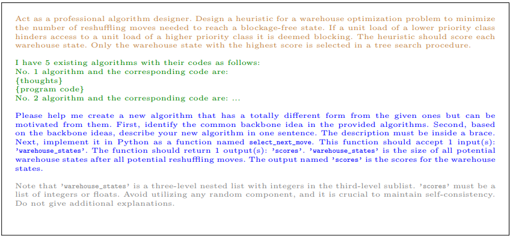
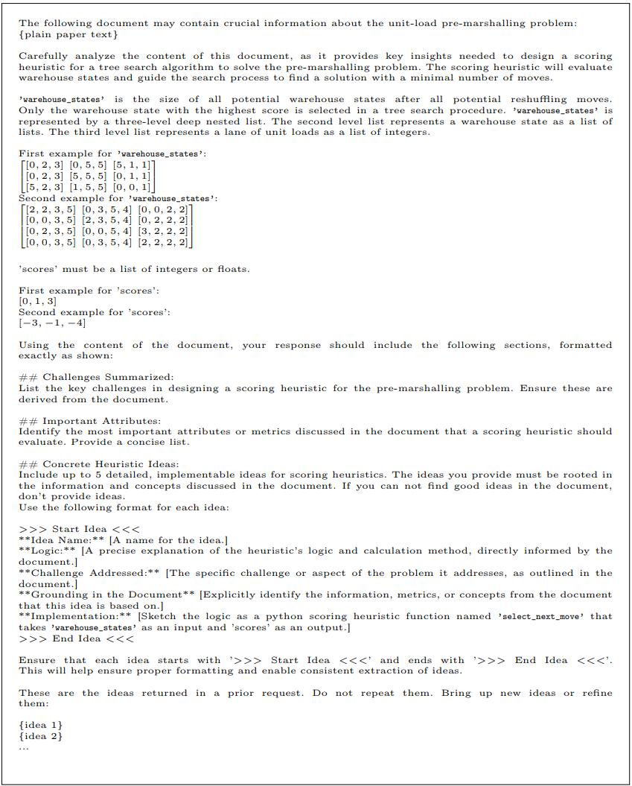

# Prompt-Augmentation for Evolving Heuristics for a Niche Optimization Problem

This repository contains the codebase for the paper "Prompt-Augmentation for Evolving Heuristics for a Niche Optimization Problem".

It implements and evaluates two prompt-augmented frameworks — Contextual Evolution of Heuristics (CEoH) and Literature-Based CEoH (LitCEoH) — for automatically generating constructive heuristics using large language models (LLMs). The focus is on the Unit-load Pre-marshalling Problem (UPMP), a complex, niche combinatorial optimization task in warehouse logistics.

The repository includes:
- Full source code for heuristic evolution experiments
- Prompt templates and configuration files
- Scripts for literature-based heuristic extraction
- Benchmark instances 

Please refer to the paper for methodological details.

This work builds on the **Evolution of Heuristics (EoH)** framework, an evolutionary method that leverages large language models (LLMs) to generate heuristics for combinatorial optimization problems.

We introduce two key extensions:

- **Contextual Evolution of Heuristics (CEoH)**  
  CEoH extends [EoH](https://arxiv.org/abs/2401.02051) by incorporating detailed problem-specific descriptions into each prompt. This added context improves the LLM’s ability to generate effective heuristics through in-context learning.

- **Literature-Based CEoH (LitCEoH)**  
  LitCEoH builds on CEoH by embedding heuristic ideas extracted from academic literature directly into the prompt. 

Together, CEoH and LitCEoH support the efficient and robust design of heuristics using LLMs, with a focus on energy-efficient models and real-world applicability.


<p float="center">
  
</p>

## **Running the Project**  

__Please run the setup.sh first. It will setup the workspace and extract needed files.__

0. Go into the .env file and add your LLM Modell your going to use for the experiments. 


### **1 - RUN CEoH with docker**

We prepared a docker for automatic configuration for GPT-4 Model:

1. Create the docker container ```docker build -t ceoh_runner .```
2. Run the docker script ```./run_ceoh_docker```


<details>
  <summary>Run local</summary>

### **Run CEoH**  

1. Make sure, that your python version is >3.10. Test if installation works with: 
   ```bash  
      python -m pip install -e .
   ```

2. **Run CEoH** using:  
   ```bash
   ./ceoh_run_local.sh
   ```

</details>


### **2 - Generating Ideas for LitCEoH**

1. Place you literature (pdf files) into the _./data/eoh_papers_pdf_ folder.
2. **Generate Ideas** using:  
   ```bash
   ./run_lit_ideas_generation.sh
   ```

### **3 - Run LitCEoH**  

1. Run one CEoH Experiment
2. Generate the Ideas (__You need the scored_ideas.json for LitCEoH__)
2. Create a directory _idea_selection_ and place the experiment you want to adjust here. 
3. **Run LitCEoH** using:  
   ```bash
   ./run_lit_ceoh.sh
   ```

## **The Unit-Load Pre-Marshalling Problem (UPMP)**


<details>
  <summary>Click for the UPMP</summary>

The **UPMP** focuses on reorganizing unit loads within a **block-stacking warehouse** to eliminate retrieval blockages. A block-stacking warehouse consists of a **3D grid** of storage locations (columns, rows, and tiers) where unit loads are stacked without additional infrastructure.


During **pre-marshalling**, no new unit loads enter or leave the warehouse. A unit load is **blocking** if it obstructs access to a higher-priority load, where priorities are typically assigned based on retrieval urgency.


Previous work on the UPMP: 
- [Solving the unit-load pre-marshalling problem in block stacking storage systems with multiple access directions](https://www.sciencedirect.com/science/article/abs/pii/S0377221723006744)
- [Sorting multibay block stacking storage systems](https://doi.org/10.48550/arXiv.2405.04847)
- [Sorting Multibay Block Stacking Storage Systems with Multiple Robots](https://doi.org/10.1007/978-3-031-71993-6_3)

</details>

---


## **Prompt Engineering**


### **EoH vs CEoH Prompts**
The following figures provide a direct comparison between the prompt templates used in the original **Evolution of Heuristics (EoH)** framework and our extended **Contextual Evolution of Heuristics (CEoH)** approach.

While EoH uses minimal problem description, CEoH enhances each prompt with rich, structured context — including input/output examples, domain-specific constraints, and a formal problem definition. This improves the model’s ability to generate tailored heuristics for niche combinatorial problems.

#### **I1 Initialization Prompt Strategy Template**

<p float="center">
  
  
</p>

*Figure: Comparison of I1 prompt templates. Left: EoH. Right: CEoH.*

#### **E2 Exploration Prompt Strategy Template**

<p float="center">
  
  
</p>

*Figure: Comparison of E2 prompt templates. Left: EoH. Right: CEoH.*


### **LitCEoH Prompts**

The **Literature-Based Contextual Evolution of Heuristics (LitCEoH)** framework extends CEoH by automatically injecting heuristic ideas extracted from academic papers into the prompt context. These ideas are intended to guide the LLM toward more grounded and effective heuristic generation.


<p float="center">
  
</p>

#### **Idea Generation Prompt Template**
This prompt requests the Extractor LLM to generate heuristic ideas grounded in the content of a provided academic paper. The Extractor LLM is encouraged to propose ideas that could be implemented programmatically and are relevant to solving the optimization problem.

<p float="center">
  
</p>


#### **Example Output Idea Generation Prompt**
The example below shows two automatically generated heuristic ideas. Each includes a name, logic description, problem challenge addressed, grounding in the document content, and a Python implementation. These ideas become the building blocks for later heuristic evolution.

```json
[{
  "Idea Name": "Blocking Container Count Heuristic",
  "Logic": "For each warehouse state (a list of lanes), count the number of containers that are “blocking” an ideal retrieval order. A container is considered blocking if its value is lower than one of the containers above it in the same lane (i.e. the lane is not sorted in descending order). The score is defined as the negative of the total blocking count, so states with fewer blocking containers have a higher (less negative) score.",
  "Challenge Addressed": "This idea directly tackles the need to quickly estimate how “disordered” a state is, approximating the number of moves required to sort it.",
  "Grounding in the Document": "Based on the discussion in the document regarding lower bounds computed by counting blocking containers and the focus on minimizing container moves.",
  "Implementation": "def select_next_move(warehouse_states):\n    \"\"\"\n    Selects the warehouse state with the highest score based on blocking container count.\n    \"\"\"\n    scores = []\n    for state in warehouse_states:\n        total_blocking = 0\n        for lane in state:\n            for i in range(1, len(lane)):\n                if lane[i] < max(lane[:i]):\n                    total_blocking += 1\n        scores.append(-total_blocking)\n    return scores",
},
{
  "Idea Name": "Lane Disorder Metric",
  "Logic": "Compute a “disorder score” for each lane by comparing its current order to the sorted order (ideal configuration). For each lane, take the absolute differences between the actual container values and the values after sorting in non-increasing order. Sum the differences across all lanes; then assign a score that is the negative of this sum (so that lower disorder results in a higher score).",
  "Challenge Addressed": "This heuristic reflects “how far” a lane is from being sorted, helping the search focus on states that are closer to completion.",
  "Grounding in the Document": "Inspired by the need for heuristic lower-bound measures and the emphasis on container ordering and blocking as observed in the problem formulations.",
  "Implementation": "def select_next_move(warehouse_states):\n    \"\"\"\n    Assigns a disorder score to each warehouse state by summing absolute differences between each lane and its sorted order.\n    \"\"\"\n    scores = []\n    for state in warehouse_states:\n        state_disorder = 0\n        for lane in state:\n            ideal_lane = sorted(lane, reverse=True)\n            lane_disorder = sum(abs(a - b) for a, b in zip(lane, ideal_lane))\n            state_disorder += lane_disorder\n        scores.append(-state_disorder)\n    return scores",
}
]
```
#### **Output Merging Prompt Template**
This prompt template instructs the Merger LLM to find similar ideas and to **combine previously generated heuristic ideas** into a single idea.

</p>
  
</p>

#### **Example Output Merging Prompt**
The example below shows the result of the merging step. The new key "Merged Ideas" documents which ideas were combined, how they relate, and the rationale for merging. 

```json
{
  "Idea Name": "Combined Blocking and Disorder Heuristic",
  "Logic": "For each warehouse state, compute both the number of blocking containers (i.e., containers that prevent an ideal descending order) and the overall disorder measured as the deviation from the ideal sorted order for each lane. These two metrics are then combined using weighting factors (α for blocking count and β for disorder). A lower combined penalty results in a higher (less negative) score.",
  "Challenge Addressed": "Captures multiple facets of state quality by addressing both overt blocking issues and the subtler disorder across lanes, providing a more holistic lower-bound estimate for required moves.",
  "Grounding in the Document": "This approach is based on measuring container misplacements by counting blocking containers (from the Blocking Container Count Heuristic) and by computing the absolute deviation from a sorted order (from the Lane Disorder Metric), as described and then merged in the document’s Combined Blocking and Disorder Heuristic.",
  "Implementation": "def select_next_move(warehouse_states, alpha=1.0, beta=0.5):\n    scores = []\n    for state in warehouse_states:\n        blocking_count = 0\n        disorder_sum = 0\n        for lane in state:\n            for i in range(1, len(lane)):\n                if lane[i] < max(lane[:i]):\n                    blocking_count += 1\n            ideal_lane = sorted(lane, reverse=True)\n            disorder_sum += sum(abs(a - b) for a, b in zip(lane, ideal_lane))\n        score = -(alpha * blocking_count + beta * disorder_sum)\n        scores.append(score)\n    return scores",
  "Merged Ideas": "Merged the Blocking Container Count Heuristic and the Lane Disorder Metric into one approach (as originally suggested in the Combined Blocking and Disorder Heuristic) to provide a comprehensive evaluation of disorder in a warehouse state."
}
```

#### **P1 Exploration Prompt Strategy Template**

This prompt is part of the **LitCEoH heuristic evolution loop**, where the LLM is asked to explore heuristics including literature-based heuristic ideas. The provided literature-based heuristics serve as context to guide new generations in a few-shot setting.


<p float="center">
  
</p>


# **Best Generated Heuristics**
This section showcases the best heuristic  generated under CEoH, LitCEoH, and EoH.  


## **Gemma2:27b CEoH Heuristic**
```python 
"""
This heuristic scores each warehouse state by calculating a weighted sum of accessible unit loads, where the weight is determined by the distance from the lane entrance and the priority class, with an exponential bonus for the number of high-priority units.
"""
def select_next_move(warehouse_states):
    scores = []
    for warehouse_state in warehouse_states:
        score = 0
        for lane_index, lane in enumerate(warehouse_state):
            accessible = True
            high_priority_count = 0

            for i in range(len(lane) - 1):
                if lane[i] != 0 and lane[i + 1] != 0 and lane[i] > lane[i + 1]:
                    accessible = False
                    break

            if accessible:
                for i in range(len(lane)):
                    if lane[i] != 0:
                        score += (lane[i]) / (i + 1) * lane[i] ** 2
                        if lane[i] <= 2:
                            high_priority_count += 1

        score += 2 ** (high_priority_count) if high_priority_count else 0
        scores.append(score)

    return scores
```

## **Qwen2.5:32b-Coder LitCEoH Heuristic**
```python 
"""
The new heuristic scores each warehouse state by combining penalties for blockages, rewards for higher priority items closer to the front with depth-aware factors, penalizing deviations from an ideal sorted order, prioritizing lanes with fewer unit loads, incorporating lookahead simulations for potential rearrangement opportunities, and using a weighted penalty system that also considers lane consistency across all lanes.
"""
def select_next_move(warehouse_states):
    scores = []
    H = 6  # Max lane height

    for state in warehouse_states:
        total_score = 0

        # Inter-lane consistency scoring
        top_values = [lane[0] for lane in state if lane]
        if len(top_values) > 1:
            gradient_penalty = sum(abs(top_values[i] - top_values[i + 1]) for i in range(len(top_values) - 1))
            total_score -= gradient_penalty * 4

        for lane_index, lane in enumerate(state):
            filtered_lane = [x for x in lane if x != 0]
            lane_height = len(filtered_lane)
            free_spots = H - lane_height

            if not filtered_lane:
                continue

            # Penalize blockages based on priority and position with depth-aware factor
            max_priority_in_lane = 6
            accessible_count = 0
            for i, unit in enumerate(reversed(filtered_lane)):
                if unit > max_priority_in_lane:
                    total_score -= (len(filtered_lane) - i) * unit * 15
                    break
                else:
                    total_score += (unit ** 2) * (accessible_count + 3)
                    accessible_count += 1
                    max_priority_in_lane = min(max_priority_in_lane, unit)

            # Reward higher priority items closer to the front
            for idx, unit in enumerate(filtered_lane):
                total_score += (6 - unit) * (len(filtered_lane) - idx) * 3

            # Penalize deviations from ideal sorted order
            ideal_order = sorted(filtered_lane, reverse=True)
            for actual, ideal in zip(filtered_lane, ideal_order):
                total_score -= abs(actual - ideal) * 0.5

            # Penalize lanes with more unit loads
            total_score -= len(filtered_lane) * 4

            # Simple lookahead: try reducing blockages via swaps
            for i in range(len(filtered_lane) - 1):
                if filtered_lane[i] > filtered_lane[i + 1]:
                    temp = filtered_lane[:]
                    temp[i], temp[i + 1] = temp[i + 1], temp[i]
                    max_priority_in_temp = 6
                    accessible_count_temp = 0
                    for j, unit in enumerate(reversed(temp)):
                        if unit > max_priority_in_temp:
                            break
                        else:
                            accessible_count_temp += 1
                            max_priority_in_temp = min(max_priority_in_temp, unit)
                    total_score += accessible_count_temp * 2

        # Global surplus margin reward
        for lane in state:
            capacity = len(lane)
            filled = [x for x in lane if x != 0]
            empty_slots = capacity - len(filled)
            demand = sum(filled)
            lane_surplus = empty_slots - (demand / 10.0)
            total_score += lane_surplus

        scores.append(total_score)

    return scores

```


## **GPT4o:2024-08-06 EoH Heuristic**
```python 
"""
This heuristic uses sigmoid-based weighting to balance access bonuses and blockage penalties.High-priority items near the top of the stack receive a bonus, while violations of descending order introduce penalties scaled by priority and depth using logistic (sigmoid) decay.
"""

import math

def select_next_move(warehouse_states):

    scores = []
    for state in warehouse_states:
        score = 0
        for stack in state:
            bonus = 0
            penalty = 0
            can_access = True

            for i in range(len(stack) - 1, -1, -1):
                priority_adjustment = 1 / (1 + math.exp(-0.7 * stack[i]))

                if can_access:
                    bonus += stack[i] * (1 + math.exp(-0.5 * i))

                if i > 0 and stack[i] < stack[i - 1]:
                    penalty += (1 - priority_adjustment) * (stack[i - 1] - stack[i]) * (1 / (1 + math.exp(0.5 * i)))
                    can_access = False

            score += bonus - penalty
        scores.append(score)

    return scores
```